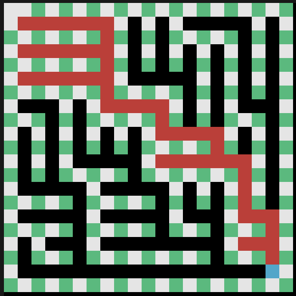
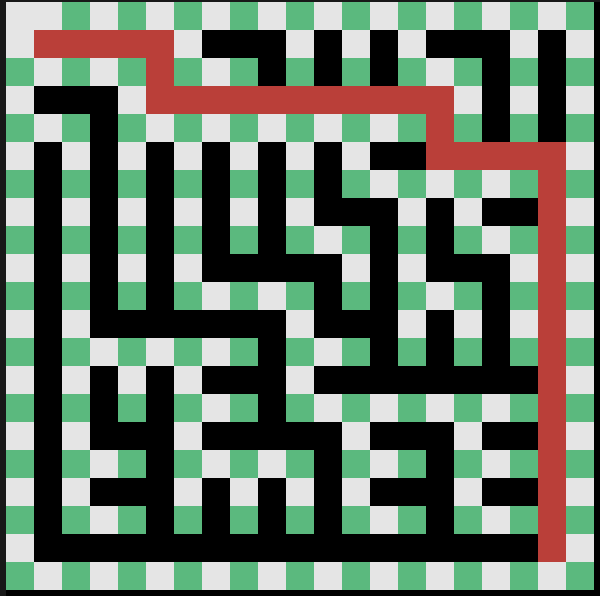
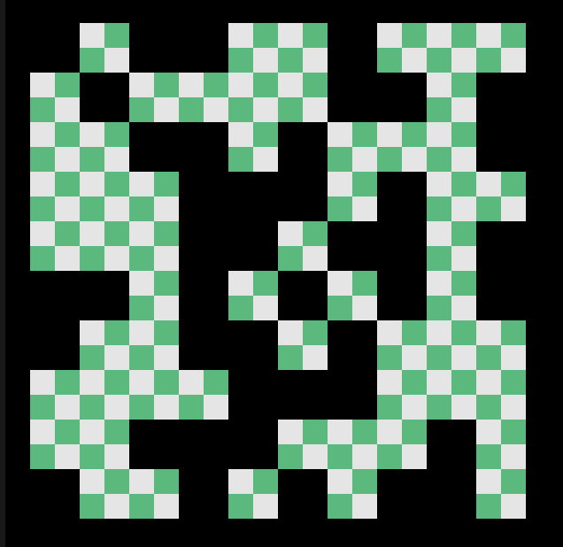
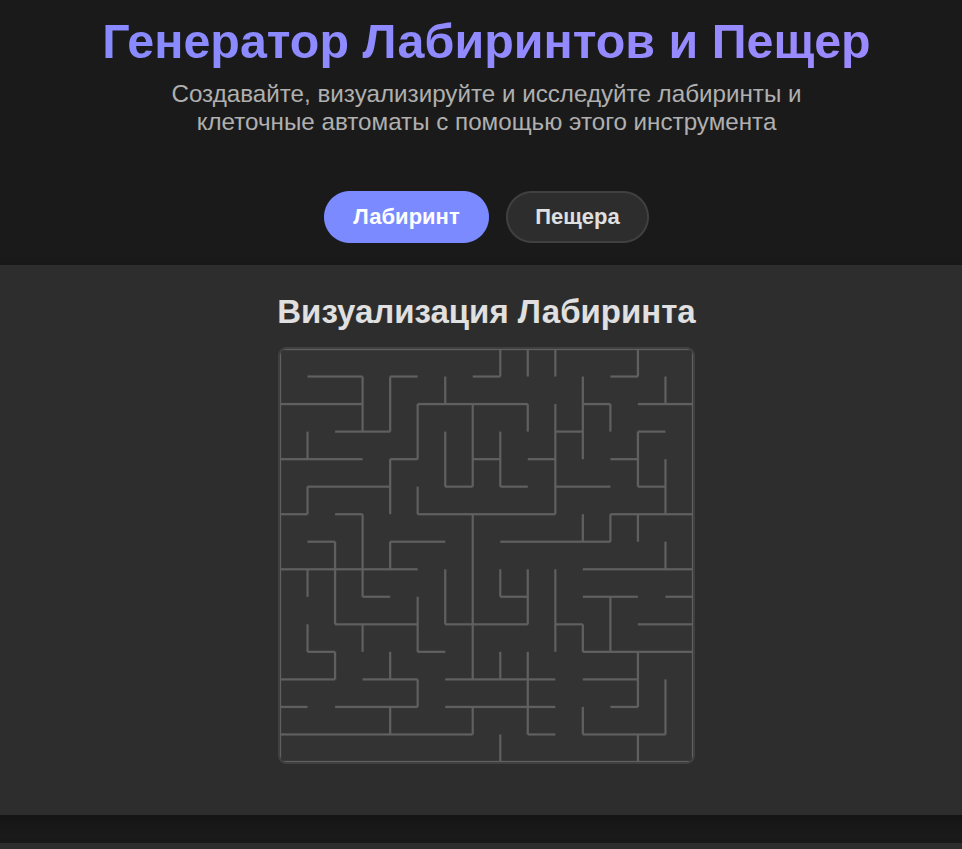

# Compilation:
```
make all
make install
make tests
make gcov_report
make clang
make rebuild
make valgrind
make clean
make uninstall
```


## Maze 
```
Web or terminal? (1 - web, 0 - terminal)
Load from file? (1 - YES, 0 - NO)
Enter filename or Size of maze(example: N M)
Do you want to solve the maze? (1 - YES, 0 - NO)
1 - ML, 0 - ALGOS
Enter start position (example: x y):
Enter finish position (example: x y):

q - exit
d - solve maze
press any key to generate new maze (exept for the q and d)
```

### Example for generated maze


##### Compile with make and past in terminal to see the picture above:

```

0
0
10 10
1
1
0 0
9 9

```
### Example for loaded maze

##### Compile with make and past in terminal to see the picture above:
```
0
1
./tests/test_maze.txt
1
1
0 0
4 9

```

## Cave

```
Load from file? (1 - YES, 0 - NO)
Enter filename or Size of cave(example: N M)
Enter living chance (example: 0.1) (NO LOAD)
Enter count of cells for life and for death (example: N M)
Manual - 0, Auto - time(500 ms recomended)
```

### Example for generated cave

##### Compile with make and past in terminal to see the picture above:
```
1
0
25 25
0.4
4 4
0

```

### Example for loaded cave

##### Compile with make and past in terminal to see the picture above:
```
1
1
./tests/test_cave.txt
1 2
500

```

### For web version


```
make
cp ./maze ./web/
cd web && go run app/main.go
```